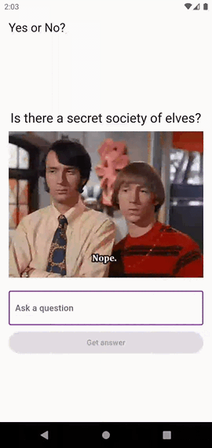

# Yes or No - Flutter App

## Overview

"Yes or No" is a simple Flutter application. While its surface functionality allows users to pose questions and receive GIF-based answers, the underlying purpose is to showcase the integration of Test-Driven Development (TDD), Clean Architecture, and best practices.

**Functionality:**

The app allows users to enter a question into an input field. After making the necessary calls, the app provides a response in the form of a GIF, indicating either "yes" or "no".


## Architecture

The app is built following the principles of Clean Architecture, ensuring separation of concerns, testability, and maintainability. It employs a wide array of packages to achieve this robust architecture:

- **State Management:** `bloc`, `flutter_bloc`
- **Networking:** `dio`, `retrofit`
- **Dependency Injection:** `get_it`
- **Localization:** `flutter_localizations`, `intl`
- **Form Handling:** `formz`
- **Functional Programming:** `dartz`
- **Utilities:** `bloc_concurrency`, `equatable`, `json_annotation`, `json_serializable`
- **Testing:** `bloc_test`, `flutter_test`, `mocktail`, `network_image_mock`
- **Code Generation:** `build_runner`, `retrofit_generator`

...among others. For a complete list, refer to the `pubspec.yaml`.

## Getting Started



### Prerequisites
- Flutter SDK version '>=3.0.6 <4.0.0'
  
### Setup and Run

1. **Clone the repository:**

```
$ git clone https://github.com/furkansoylemez/yes_or_no.git
```

2. **Navigate to the project directory:**

```
$ cd yes_or_no
```

3. **Install dependencies:**

```
$ flutter pub get
```

4. **Run the app:**

```
$ flutter run
```